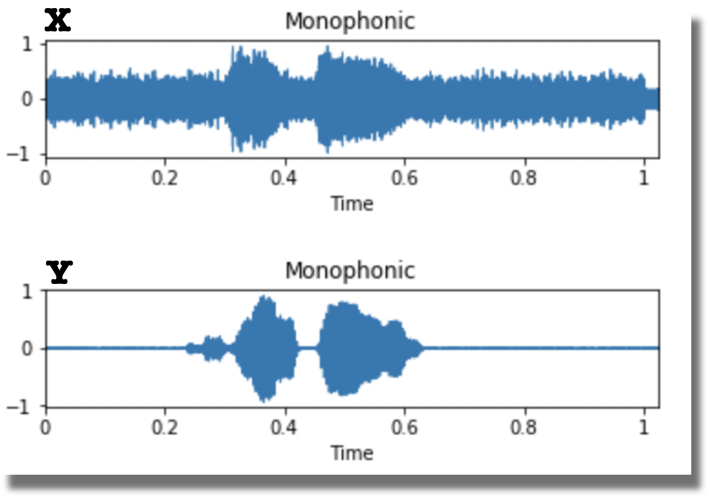

# Cycle Consitency Audios Noise Filter (CycleGAN ANF)

>The Notebook `ANF_Train.ipynb` is the main procedure and self-explained. It is a good place to start.

In this project, we're going to define and train a CycleGAN ANF to read in a raw audio sample from a set `X` (voice mixed noise) and transform it so that it sound as if it belongs in set `Y` (clear voice). Eventually, what we try to achieve is eliminating environmental sound (**noise filter**) and extracting only the speaker's voice.

>The objective will be to train generators that learn to transform a raw audio sample from domain `X` into a raw audio file that sounds like it came from domain `Y` (and vice versa). 

Examples of data in both sets are pictured below.



###  Training Data

These audios samples do not come with labels, are stored in folders such as `X`, `Y`, `test_X` and `test_Y` in `data` folder. 

### Local  Setup

You should run this project with GPU acceleration for best performance. Highly recommend this tutorial https://medium.com/mcgill-artificial-intelligence-review/tutorial-setting-up-a-gpu-enabled-virtual-machine-on-microsoft-azure-f9a32fa1b536

1. Install Pytorch.

        - Option 1: __Install with Conda__,
        ```
        conda install pytorch torchvision -c pytorch
        ```

        - Option 2: __To install with PIP__,
        ```
        pip install torch torchvision
	```
        
2. Obtain the `libav` package.

        - __Linux__: `sudo apt-get install libav-tools`

# Acknowledgments

Code borrows from:

* https://github.com/junyanz/CycleGAN
* https://github.com/lukysummer/WaveGAN-Speech-Synthesis
* https://github.com/chrisdonahue/wavegan/
* https://github.com/jtcramer/wavegan/
